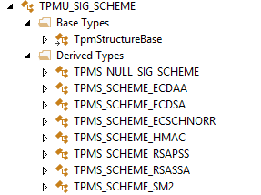
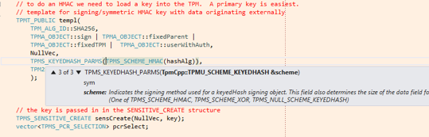

*Paul England, Dennis Mattoon, Microsoft Corporation*

# Introduction

TSS.C++ is a library for programming version 2.0 of the Trusted Platform
Module (TPM). It supports the TPM2.0 reference implementation through
the standard TCP/IP socket connection as well as the TPM Base Services
(TBS) interface available in Windows. TSS.C++ is written in C++11, and
can be built for Linux-based platforms (g++/make) as well.

The philosophy of TSS.C++ is to be a complete but very thin wrapper
around the capabilities of the TPM. In most cases TPM functions are
exposed by TSS.C++ with (essentially) the same input and return
parameters that are defined in the TPM specification. Similarly, all
data structures defined in the specification have been translated into
corresponding C++ types (e.g., classes and enumerations).

However, within these specification-to-library mapping constraints, we
have made every effort to keep TPM development as easy as possible.[^1]
In this respect, TSS.C++ is conceptually (and practically) very similar
to Microsoft’s C# TSS.Net library. For instance, here is a simple but
complete sample function that demonstrates obtaining random numbers from
a TPM on Windows 8.

void GetRandomTbs()

{

// Create a TpmDevice object and attach it to the TPM. Here we

// use the Windows TPM Base Services OS interface.

TpmTbsDevice device;

if (!device.Connect()) {

cerr \<\< "Could not connect to the TPM device";

return;

}

// Create a Tpm2 object "on top" of the device.

Tpm2 tpm(device);

// Get 20 bytes of random data from

std::vector\<BYTE\> rand = tpm.GetRandom(20);

// Print it out.

cout \<\< "Random bytes: " \<\< rand \<\< endl;

return;

}

Here is the same functionality, but using the Microsoft TPM simulator
rather than a real TPM. The main difference is that the programmer must
perform some of the startup functions that would normally be performed
by the BIOS.

void GetRandomSimulator()

{

// Create a TpmDevice object and attach it to the TPM. Here we

// attach to a TPM simulator process running on the same host.

TpmTcpDevice device;

if (!device.Connect("127.0.0.1", 2321)) {

cerr \<\< "Could not connect to the TPM device";

return;

}

// Create a Tpm2 object "on top" of the device.

Tpm2 tpm(device);

// When talking to the simulator you must perform some of the startup

// functions that would normally happen automatically or be done by

// the BIOS (note: PowerOff does nothing if the TPM is already powered

// off, but let’s this sample run whatever the state of the TPM.)

device.PowerOff();

device.PowerOn();

tpm.Startup(TPM_SU::CLEAR);

// Get 20 bytes of random data

std::vector\<BYTE\> rand = tpm.GetRandom(20);

// And print it out.

cout \<\< "Random bytes: " \<\< rand \<\< endl;

// And shut down the TPM

tpm.Shutdown(TPM_SU::CLEAR);

device.PowerOff();

return;

}

Because development is generally easier against the TPM simulator, and
because not all TPM features are exposed by the BIOS, most of the
samples in the TSS.C++ distribution use the simulator.

This remainder of this document is an overview of TSS.C++; mostly
through annotations of working example code included in the
distribution. It describes how the library can be used to access the TPM
and how the library is derived from the TPM specification. This document
(and some more advanced samples in the distribution) also attempt to
illustrate the use of the TPM to support common scenarios.

# TSS.C++ by Example

In this section we introduce TSS.C++ through a series of annotated
examples. The sample source code is included in this document, but the
runnable samples themselves (and some surrounding scaffolding like TPM
startup) are also included in the DocSamples.cpp file in the TSS.CPP
Samples project in the TSS.C++ distribution.

If you are attempting to learn TSS.C++ (or the TPM itself) we recommend
that you open the TSS.C++ solution in Visual Studio 2013 (or higher) and
step through the samples using the built-in debugger (this is described
in more detail in Appendix A). By default the TSS.CPP Samples
application first runs the samples in this document, and then runs a
more complete set of samples in the file Samples.cpp.

Since the samples run against the TPM simulator, the simulator must also
be running on the same host as TpmCppTest.exe. A description of how this
is done, and what you can do to run the sample set against a simulator
on a remote system, can be found in Appendix A – Setting up the TPM and
TSS.C++.

## Initializing TSS.C++ and the TPM

All of the samples that follow assume the following definitions and that
the InitTpm() routine has been called.

// All TSS.C++ code is in the TpmCpp namespace

using namespace TpmCpp;

\#include "Samples.h"

// Run the samples described in the TSS.C++ Intro paper in turn

void RunSamples();

Tpm2 tpm;

TpmTcpDevice device;

// Initialize the library and local TPM

void InitTpm()

{

// Connect the Tpm2 device to a simulator running on the same machine

if (!device.Connect("127.0.0.1", 2321)) {

cerr \<\< "Could not connect to the TPM device";

return;

}

// Instruct the Tpm2 object to send commands to the local TPM simulator

tpm.\_SetDevice(device);

// Power-cycle the simulator

device.PowerOff();

device.PowerOn();

// And startup the TPM

tpm.Startup(TPM_SU::CLEAR);

return;

}

Here, we highlight some TSS.C++ mechanisms.

Highlight 1: Illustrates two fundamental
characteristics of TSS.C++. First, all TPM2.0 commands are represented
as methods in the Tpm2 class. Input parameters are provided almost
exactly as defined in the specification (output parameters are handled
somewhat differently, as described later in this document).

Second, all TPM-defined data structures are translated into
similarly-named C++ types. TPM_SU is a constant collection, and constant
collections are translated into C++ class-enumerations. Other
translations will be introduced by example, but are similarly
straightforward: for example TPM structures are translated into
similarly-named C++ classes.

Highlight 2: Illustrates how non-TPM state and
functions are exposed by Tpm2. TSS.C++ adopts a naming convention where
TPM-defined functions are named as they appear in the specification
(omitting the TPM2\_ boilerplate), and all other (helper-)functions are
prepended with an underscore. This line in the example simply attaches
the Tpm2 object to an object that can communicate with a TPM. TSS.C++
ships with two such devices: one that talks to a simulator over TCP/IP
(TpmTcpDevice), and one that talks to a TPM2 on Windows (TpmTbsDevice).

## Arrays

The TPM interface makes heavy use of length-prepended arrays (BYTEs,
UINT32s, and arrays of more complex structures). TSS.C++ uses Standard
Template Library (STL) std::vector\<\> types to pass array data
back-and-forth from the TPM. This is illustrated in the
ArrayParameters() sample below.

void ArrayParameters()

{

// Get 20 random bytes from the TPM

std::vector\<BYTE\> rand = tpm.GetRandom(20);

cout \<\< "Random bytes: " \<\< rand \<\< endl;

// Get random data from the (default) OS random-number generator and

// add it to the TPM entropy pool.

vector\<BYTE\> osRand =
tpm.\_GetRandLocal(20);

tpm.StirRandom(osRand);

return;

}

  
Highlight 1 illustrates how TSS.C++ returns array data, and
Highlight 2 illustrates how array data is
passed to the TPM.

The TPM itself still needs length-prepended TPM-formatted array data, of
course, but this is automatically generated by the TSS.C++ marshaller.

Highlight 1 also demonstrates one of the
TSS.C++ TPM return parameter translations: if a TPM function has a
single return value then it is returned directly (if there are multiple
return parameters then they are returned in an enclosing class, as
illustrated later).

## Handles and Password Authorization (PWAP)

The following example illustrates how TSS.C++ manages simple
password-authorization of actions.

Most TPM operations need to be authorized. The simplest form of
authorization (and arguably the most common) is to provide the TPM with
the plaintext authorization value associated with the object/action that
is to be performed. This is called Password Authorization Protocol
(PWAP).

Similarly, most TPM entities are referenced using a TPM “handle.”
Entities include loaded keys, sessions, and also security roles like the
owner or privacy administrator. The TPM specification defines the
TPM_HANDLE as a simple UINT32. TSS.C++ defines a TPM_HANDLE class that
encapsulates the UINT32 handle value, but also contains the
authorization value associated with that entity (and the corresponding
entity name, as illustrated later). In some cases TSS.C++ can
automatically set the authorization value based on prior use, in other
cases it must be set explicitly, as shown below.

void PWAPAuth()

{

// Most TPM entities are referenced by handle

TPM_HANDLE platformHandle =
TPM_HANDLE::FromReservedHandle(TPM_RH::PLATFORM);

// The TSS.C++ TPM_HANDLE class also includes an authValue to be used

// whenever this handle is used.

vector\<BYTE\> NullAuth {};

platformHandle.SetAuth(NullAuth);

// If we issue a command that needs authorization TSS.C++ automatically

// uses the authValue contained in the handle.

tpm.Clear(platformHandle);

// We can use the "old" platform-auth to install a new value

vector\<BYTE\> newAuth { 1, 2, 3, 4, 5 };

tpm.HierarchyChangeAuth(platformHandle,
newAuth);

// If we want to do further TPM administration we must associate the new

// authValue with the handle.

platformHandle.SetAuth(newAuth);

tpm.Clear(platformHandle);

// And put things back the way they were

tpm.HierarchyChangeAuth(platformHandle,
NullAuth);

return;

}

  
Highlight 1: Illustrates how an auth value is associated with a
handle (since both the TPM and TSS.C++ starts up with a zero-length auth
value, this line is not strictly necessary).

Highlight 2: All of these lines illustrate the
use of a TPM_HANDLE to perform an action (clearing the TPM – an
irreversible action that makes all previously stored data
unrecoverable). The TPM requires that this action be performed by one of
the TPM administrators: we illustrate how the platform (BIOS) might do
this. To perform the action the caller must provide proof-of-knowledge
of the associated auth value using a session. By default TSS.C++ does
this using a PWAP session. Basically, the library knows what handles
need authorization, and automatically constructs a PWAP session for each
*using the auth value in the associated handle*.

## Handling Errors

By default, if the TPM returns an error then an exception is thrown, but
this behavior can be overridden on a command-by-command basis as shown
in the sample below

void Errors()

{

// Construct an illegal handle value

TPM_HANDLE invalidHandle((UINT32) - 1);

// Try to read the associated information

try {

tpm.ReadPublic(invalidHandle);

}

catch (system_error e) {

// Note that the following e.what() may produce a platform specific

// result. For example, this error typically corresponds to the ERFKILL

// errno on a linux platform.

cout \<\< "As expected, the TPM returned an error:" \<\< e.what() \<\<
endl;

}

// We can also suppress the exception and do an explit error check

tpm.\_AllowErrors().ReadPublic(invalidHandle);

if (tpm.\_GetLastError() != TPM_RC::SUCCESS) {

cout \<\< "Command failed, as expected." \<\< endl;

}

// If we WANT an error we can turn things around so that an exception is

// thrown if a specific error is \_not\_ seen.

tpm.\_ExpectError(TPM_RC::VALUE).ReadPublic(invalidHandle);

// Or any error

tpm.\_DemandError().ReadPublic(invalidHandle);

return;

}

Here, the command-decorations are as follows:

| **Error-Handling-Related Tpm2 function** | **Meaning**                                                                      |
|------------------------------------------|----------------------------------------------------------------------------------|
| \_ExpectError(TPM_RC expectedError)      | Throw an exception if the next TPM command does *not* return the expected error. |
| \_AllowErrors()                          | Silently allow the next command to succeed or fail                               |
| \_DemandError()                          | Throw an exception if the next command succeeds                                  |
| TPM_RC \_GetLastError()                  | Get the last error code (may be TPM_RC::SUCCESS)                                 |
| bool \_LastCommandSucceeded()            | Returns true or false                                                            |

## TPM2 Structures

TPM.C++ represents all TPM2 structures as similarly named classes with
similarly named and typed members. For instance, the TPMS_AUTH_COMMAND
structure is defined as follows in the TPM specification:

Table 118 — Definition of TPMS_AUTH_COMMAND Structure \<IN\>

|                   |                       |                                             |
|-------------------|-----------------------|---------------------------------------------|
| Parameter         | Type                  | Description                                 |
| sessionHandle     | TPMI_SH_AUTH_SESSION+ | the session handle                          |
| nonce             | TPM2B_NONCE           | the session nonce, may be the Empty Buffer  |
| sessionAttributes | TPMA_SESSION          | the session attributes                      |
| hmac              | TPM2B_AUTH            | either an HMAC, a password, or an EmptyAuth |

And in TSS.C++, it maps to the following class:

/// \<summary\> This is the format used for each of the authorizations
in

/// the session area of a command.\</summary\>

class \_DLLEXP\_ TPMS_AUTH_COMMAND : public TpmStructureBase

{

friend class StructMarshallInfo;

/// \<summary\>The session handle\</summary\>

public: TPM_HANDLE sessionHandle;

/// \<summary\>Size in octets of the buffer field; may be 0\</summary\>

protected: UINT16 nonceSize;

/// \<summary\>The session nonce, may be the Empty Buffer\</summary\>

public: std::vector\<BYTE\> nonce;

/// \<summary\>The session attributes\</summary\>  
public: TPMA_SESSION sessionAttributes;  
  
/// \<summary\>Size in octets of the buffer field; may be
0\</summary\>  
protected: UINT16 hmacSize;  
  
/// \<summary\>Either an HMAC, a password, or an EmptyAuth\</summary\>  
public: std::vector\<BYTE\> hmac;  
  
\<snip\>  
  
/// \<summary\>This is the format used for
each of the authorizations  
/// in the session area of a command.\</summary\>  
///\<param name = "sessionHandle"\>the session
handle\</param\>  
///\<param name = "nonce"\>the session nonce, may be the Empty
Buffer\</param\>

///\<param name = "sessionAttributes"\>the session attributes\</param\>

///\<param name = "hmac"\>either an HMAC, a password, or an
EmptyAuth\</param\>

public: TPMS_AUTH_COMMAND(

const TPM_HANDLE& sessionHandle,

const std::vector\<BYTE\>& nonce,  
const TPMA_SESSION& sessionAttributes,  
const std::vector\<BYTE\>& hmac  
);  
};

Several things should be noted:

Highlight 1: Most structure members are simply
represented as public members of the class with the same name.

Highlight 2: Arrays are simplified in favor of
the TSS.C++ library user. In the specification type, TPM2B_NONCE is a
UINT16-prepended byte-array. Here we show that (1) we have removed the
TPM2B object to avoid an unnecessary nested type, (2) the actual array
contents becomes a std::vector\<BYTE\>, and (3) the length of the array
becomes a hidden (protected) member whose value will be set from the
length of the array when it is needed.

Highlight 3: We provide constructors to
quickly and easily create TPM2 objects.

Highlight 4: TSS.C++ provides documentation
tags derived from the specification. These are typically consumed by the
development environment (e.g. Visual Studio) to provide parameter and
type tips for the programmer. This is further illustrated later.

Also note that all TPM structures derive from TpmStructureBase. This
means that they inherit rich functionality for JSON-serialization,
printing, conversion to-and-from TPM2-byte-representation, etc. The full
set of features is described in Appendix C – Standard TPM-structure
support, and some features are illustrated below.

void Structures()

{

UINT32 pcrIndex = 0;

// "Event" PCR-0 with the binary data

tpm.PCR_Event(pcrIndex, std::vector\<BYTE\> { 0, 1, 2, 3, 4 });

// Read PCR-0

vector\<TPMS_PCR_SELECTION\> pcrToRead {
TPMS_PCR_SELECTION(TPM_ALG_ID::SHA1, pcrIndex) };

PCR_ReadResponse pcrVal =
tpm.PCR_Read(pcrToRead);

// Now print it out in pretty-printed human-readable form

cout \<\< "Text form of pcrVal" \<\< endl \<\<
pcrVal.ToString() \<\< endl;

// Now in JSON

string pcrValInJSON =
pcrVal.Serialize(SerializationType::JSON);

cout \<\< "JSON form" \<\< endl \<\< pcrValInJSON \<\< endl;

// Now in TPM-binary form

vector\<BYTE\> tpmBinaryForm = pcrVal.ToBuf();

cout \<\< "TPM Binary form:" \<\< endl \<\< tpmBinaryForm \<\< endl;

// Now rehydrate the JSON and binary forms to new structures

PCR_ReadResponse fromJSON, fromBinary;

fromJSON.Deserialize(SerializationType::JSON,
pcrValInJSON);

fromBinary.FromBuf(tpmBinaryForm);

// And check that the reconstituted values are the same as the originals
with

// the built-in value-equality operators.

if (pcrVal != fromJSON) {

cout \<\< "JSON Deserialization failed" \<\< endl;

}

if (pcrVal == fromBinary) {

cout \<\< "Binary serialization succeeded" \<\< endl;

}

return;

}

We start this function by “eventing” some data into PCR-0 to make its
value more interesting when it is read.

Highlight1: Here we read the value of PCR-0
from the TPM. The command PCR_Read returns several pieces of data, so
TSS.C++ has an automatically synthesized structure to hold the return
information. Automatically synthesized return-structures are always
named *TpmFunctionName*Response.

Highlight 2: Illustrates serialization to a
human-readable string. This results in this output to stdout:

class PCR_ReadResponse

{

UINT32 pcrUpdateCounter = 0x0003 (3)

UINT32 pcrSelectionOutCount = 0x0001 (1)

TPMS_PCR_SELECTION\[\] pcrSelectionOut =

\[

class TPMS_PCR_SELECTION

{

TPM_ALG_ID hash = SHA1 (0x4)

byte sizeofSelect = 0x3 (3)  
BYTE\[\] pcrSelect = \[010000\]  
}  
\]

UINT32 pcrValuesCount = 0x0001 (1)

TPM2B_DIGEST\[\] pcrValues =

\[

class TPM2B_DIGEST

{

UINT16 size = 0x14 (20)

BYTE\[\] buffer = \[a621d402 fadc3901 72b432d2 6edf3b2b 6b65e1dd\]

}

\]

}

Note that enumerated types are represented in string form where
possible.

Highlight3: Shows serialization to JSON. This
results in the following output:

{

"pcrUpdateCounter":3 ,

"pcrSelectionOutCount":1 ,

"pcrSelectionOut":

\[

{

"hash":4 ,

"sizeofSelect":3 ,

"pcrSelect":\[1, 0, 0\]

}

\],

"pcrValuesCount":1 ,

"pcrValues":

\[

{

"size":20 ,

"buffer":\[166, 33, 212, 2, 250, 220, 57, 1, 114, 180, 50, 210, 110,
223, 59, 43, 107, 101, 225, 221\]

}

\]

}

Highlight 4: This shows serialization to
TPM-standard binary form. That results in this output:

00000003 00000001 00040301 00000000 00010014 a621d402 fadc3901 72b432d2
6edf3b2b 6b65e1dd

  
Highlight 5: Shows that binary and JSON forms can be
de-serialized back to the corresponding TPM-structures. Finally, the
last few lines show that structures can be value-compared using standard
C++ operators.

All TPM structures implement this standard functionality. Additionally,
for a few structures we have added specific helper-functions. For
example, TPMT_PUBLIC (the structure that holds a public key) has
functions to verify digital signatures and quotes, and TPMT_HA (the
structure that holds a hash value) has functions to mimic the TPM
Event() and Extend() behavior. The full set of extensions is described
in Appendix D – Structure-Specific TSS.C++ Extensions.

## HMAC Sessions

When using PWAP authorization, authorization values are communicated
from TSS.C++ to the TPM in plaintext. When TSS.C++ is communicating to a
TPM over a channel that is untrustworthy (a network, for example) this
may not be desirable, so the TPM and TSS.C++ allows proof-of-knowledge
of a password by means of an HMAC.

The protocol (and indeed proper use) of HMAC sessions are beyond the
scope of this document, but TSS.C++ makes HMAC sessions easy to use, as
demonstrated below:

void HMACSessions()

{

// Start a simple HMAC authorization session: no salt, no encryption, no
bound-object.

AUTH_SESSION s = tpm.StartAuthSession(TPM_SE::HMAC,
TPM_ALG_ID::SHA1);

// Perform an operation authorizing with an HMAC

tpm.\_Sessions(s).Clear(tpm.\_AdminPlatform);

// A more terse way of associating an explicit session with a command

tpm(s).Clear(tpm.\_AdminPlatform);

// And clean up

tpm.FlushContext(s);

return;

}

  
Highlight 1: First, the TPM command StartAuthSession takes lots
of parameters so we have provided some versions with default settings
that cover common cases. This highlighted alternative creates an HMAC
session with no bound object, no salt, and no parameter encryption.

Second, while the TPM only returns a TPM_HANDLE, conceptually an
authorization session contains much more state. We encapsulate this
state (and the TPM_HANDLE) in an AUTH_SESSION structure.

Highlight 2: This shows how a session is used.
As with PWAP, the auth value must be known to TSS.C++ and must be
associated with the corresponding TPM_HANDLE. Here we use the Tpm2
member variable \_AdminPlatform, which is initialized to
TPM_RH::PLATFORM.

The two equivalent forms tpm.\_Sessions(s0, s1,
…) and tpm(s0, s1…) are used to
indicate that the default PWAP behavior should be replaced with HMAC
authorization using the named session. Under the covers TSS.C++ tracks
the nonces, calculates the parameter hashes, and performs the HMAC.

TSS.Net also allows the use of an external entity to perform the HMAC
through a callback. This is not currently supported in TSS.C++.

Highlight 3: Note that TSS.C++ does *not*
manage object lifetime. The developer (or an underlying resource
manager) is responsible for TPM slot-management.

## Other Sessions

TSS.C++ supports encrypting sessions as well as command and session
auditing. See the samples in Samples.cpp, for a full working example.
However, to give a flavor of the support we provide some code fragments
in the following sections.

### Audit Sessions

The following is a code fragment from Samples.cpp (attesting key
creation is omitted).

// Session-audit cryptographically tracks commands issued in the context
of the session

AUTH_SESSION s = tpm.StartAuthSession(TPM_SE::HMAC,

TPM_ALG_ID::SHA1,

TPMA_SESSION::audit \|

TPMA_SESSION::continueSession,

TPMT_SYM_DEF::NullObject());

tpm.\_StartAudit(TPMT_HA(TPM_ALG_ID::SHA1));

tpm.\_Audit().\_Sessions(s).GetRandom(20);

tpm.\_Audit().\_Sessions(s).StirRandom(ByteVec { 1, 2, 3, 4 });

TPMT_HA expectedHash = tpm.\_GetAuditHash();

tpm.\_EndAudit();

auto sessionQuote =
tpm.GetSessionAuditDigest(tpm.\_AdminEndorsement,

signingKey,

s,

NullVec,

TPMS_NULL_SIG_SCHEME());

quoteOk =
pubKey.outPublic.ValidateSessionAudit(expectedHash,

NullVec,

sessionQuote);

if (quoteOk) {

cout \<\< "Session-audit quote OK." \<\< endl;

}

Command and session audit are most useful in two scenarios:

1)  If the control logic is running on a server and the server needs to
    know if the command sequence was executed faithfully, and

2)  The command sequence logic runs on the client, and the client wants
    to provide proof to the server that the expected commands were
    indeed executed through a command or session audit.

TSS.C++ provides the best support for the first case: the server-side
library can be instructed to keep a running hash of the “expected”
command or session hash that the TPM will calculate if the sequence has
not been subverted. This functionality is enabled through the
\_StartAudit() and \_EndAudit(), highlighted
bookends.

Later, the programmer can ask the TPM to sign
the TPM’s record of the audit hash, which can then be
compared with the value calculated by TSS.C++.

### Parameter Encryption

The following is a code fragment from Samples.cpp (storage primary
creation is omitted).

// Read some data unencrypted

auto plaintextRead = tpm.ReadPublic(storagePrimary);

// Make an encrypting session

sess = tpm.StartAuthSession(TPM_SE::HMAC, TPM_ALG_ID::SHA1,

TPMA_SESSION::continueSession \|
TPMA_SESSION::encrypt,

TPMT_SYM_DEF(TPM_ALG_ID::AES, 128,
TPM_ALG_ID::CFB));

auto encryptedRead =
tpm.\_Sessions(sess).ReadPublic(storagePrimary);

if (plaintextRead == encryptedRead) {

cout \<\< "Return parameter encryption succeeded" \<\< endl;

}

\_ASSERT(plaintextRead == encryptedRead);

TSS.C++ support for session encryption is transparent. The
highlighted portion shows how an encrypting
session is created. If the session is used in
command invocation, then the appropriate input or output encryption and
decryption is automatically performed.

## TPM Unions

The TPM uses C unions when algorithm-dependent parameters need to be
passed to and from the TPM. For example, the structure that describes an
ECC public key (a TPMS_ECC_POINT) and the structure that describes an
RSA public key (a TPM2B_PUBLIC_KEY_RSA) are contained in a union called
TPMU_PUBLIC_ID.

Unions are always used in enveloping structures with an earlier member
called the union-selector (often a TPM_ALG_ID) that indicates which of
the union aliases should be used.

TPM unions are translated into C++ classes similarly to how structures
are transformed, but where simple structures derive from
TpmStructureBase, each union member is translated into a structure
derived from an intermediate class synthesized from the union.

For example, the union TPMU_SIG_SCHEME has members for all of the
signature schemes supported by TPM2. Here is the table from the
specification.

Table 141 — Definition of TPMU_SIG_SCHEME Union \<IN/OUT, S\>

|           |                       |                   |                                                              |
|-----------|-----------------------|-------------------|--------------------------------------------------------------|
| Parameter | Type                  | Selector          | Description                                                  |
| rsassa    | TPMS_SCHEME_RSASSA    | TPM_ALG_RSASSA    | PKCS#1v1.5 scheme                                            |
| rsapss    | TPMS_SCHEME_RSAPSS    | TPM_ALG_RSAPSS    | PKCS#1v2.1 PSS scheme                                        |
| ecdsa     | TPMS_SCHEME_ECDSA     | TPM_ALG_ECDSA     | ECDSA scheme                                                 |
| sm2       | TPMS_SCHEME_SM2       | TPM_ALG_SM2       | ECDSA from SM2                                               |
| ecdaa     | TPMS_SCHEME_ECDAA     | TPM_ALG_ECDAA     | ECDAA scheme                                                 |
| ecSchnorr | TPMS_SCHEME_ECSCHNORR | TPM_ALG_ECSCHNORR | EC Schnorr                                                   |
| hmac      | TPMS_SCHEME_HMAC      | TPM_ALG_HMAC      | HMAC scheme                                                  |
| any       | TPMS_SCHEME_SIGHASH   |                   | Selector that allows access to digest for any signing scheme |
| null      |                       | TPM_ALG_NULL      | No scheme or default                                         |

From which TSS.C++ forms the following class hierarchy:

Structures containing unions have members that are pointers to the union
base class, e.g., a TPMU_SIG_SCHEME\* in the example above. For TPM
input, the programmer provides an instance of a class derived from
TPMU_SIG_SCHEME such as TPMS_SCHEME_RSASSA. The library then infers the
union selector and sets it without further programmer involvement.[^2]

For example, in the following snippet the programmer is providing a
template for the TPM to create a new HMAC key:

TPMT_PUBLIC templ(TPM_ALG_ID::SHA256,TPMA_OBJECT::sign\|
TPMA_OBJECT::fixedParent \|

TPMA_OBJECT::fixedTPM \| TPMA_OBJECT::userWithAuth, NullVec,

TPMS_KEYEDHASH_PARMS(TPMS_SCHEME_HMAC(hashAlg)),

TPM2B_DIGEST_Keyedhash(NullVec));

The third parameter to TPMT_PUBLIC is TPMU_PUBLIC_PARMS\*, and
TPMS_KEYED_HASH_PARMS (a parameter relevant to HMAC keys) is derived
from TPMU_PUBLIC_PARMS. When this data structure is sent to the TPM the
hidden TPM_ALG_ID “type” parameter is set to TPM_ALG_HMAC.

Practically TSS.C++ and a programmer IDE help a lot with this. The
following figure shows the “intellisense” tooltip provided by the Visual
Studio development environment. It provides hints to the programmer
regarding what types are allowed.

## Creating and Using Primary Keys

This sample differs from earlier samples in that it illustrates a more
complete scenario example rather than introducing new TSS.C++ features.
In the following sample we use the TPM to create a non-migratable
RSA1024 signing key, and use it to sign a message.

void SigningPrimary()

{

// To create a primary key the TPM must be provided with a template.

// This is for an RSA1024 signing key.

vector\<BYTE\> NullVec;

TPMT_PUBLIC templ(TPM_ALG_ID::SHA1,

TPMA_OBJECT::sign \|

TPMA_OBJECT::fixedParent \|

TPMA_OBJECT::fixedTPM \|

TPMA_OBJECT::sensitiveDataOrigin \|

TPMA_OBJECT::userWithAuth,

NullVec,

TPMS_RSA_PARMS(

TPMT_SYM_DEF_OBJECT::NullObject(),

TPMS_SCHEME_RSASSA(TPM_ALG_ID::SHA1), 1024, 65537),

TPM2B_PUBLIC_KEY_RSA(NullVec));

// Set the use-auth for the key. Note the second parameter is NULL

// because we are asking the TPM to create a new key.

ByteVec userAuth = ByteVec { 1, 2, 3, 4 };

TPMS_SENSITIVE_CREATE sensCreate(userAuth, NullVec);

// We don't need to know the PCR-state with the key was created so set
this

// parameter to a null-vector.

vector\<TPMS_PCR_SELECTION\> pcrSelect {};

// Ask the TPM to create the key

CreatePrimaryResponse newPrimary = tpm.CreatePrimary(tpm.\_AdminOwner,

sensCreate,

templ,

NullVec,

pcrSelect);

// Print out the public data for the new key. Note the "false" parameter
to

// ToString() "pretty-prints" the byte-arrays.

cout \<\< "New RSA primary key" \<\< endl \<\<
newPrimary.outPublic.ToString(false)\<\< endl;

// Sign something with the new key. First set the auth-value in the
handle.

TPM_HANDLE& signKey = newPrimary.objectHandle;

signKey.SetAuth(userAuth);

TPMT_HA dataToSign = TPMT_HA::FromHashOfString(TPM_ALG_ID::SHA1, "abc");

auto sig = tpm.Sign(signKey,

dataToSign.digest,

TPMS_NULL_SIG_SCHEME(),

TPMT_TK_HASHCHECK::NullTicket());

cout \<\< "Signature:" \<\< endl \<\< sig.ToString(false) \<\< endl;

// Use TSS.C++ to validate the signature

bool sigOk = newPrimary.outPublic.ValidateSignature(dataToSign.digest,

\*sig.signature);

\_ASSERT(sigOk);

tpm.FlushContext(newPrimary.objectHandle);

return;

}

## 

## Non-Primary Keys

The samples ChildKeys() and Attestation() in Samples.cpp illustrate the
creation of storage primaries, children of storage primaries, and
various types of attestation.

## Quoting

The TPM supports attestation by signing internal data. Types of
attestation include platform state (quoting or signing PCR(s)), time
attestation, and key attestation, e.g., using one key to prove that
another key was created on the same TPM. TSS.C++ supports attestation by
exposing the relevant TPM functionality (of course), but also by
providing a set of helper functions (that will often run on servers) to
validate Quotes and the data that is reported.

For example, the following fragment obtains a PCR-quote from the TPM and
validates it:

// First PCR-signing (quoting). We will sign PCR-7.

cout \<\< "\>\> PCR Quoting" \<\< endl;

auto pcrsToQuote =
TPMS_PCR_SELECTION::GetSelectionArray(TPM_ALG_ID::SHA1, 7);

// Do an event to make sure the value is non-zero

tpm.PCR_Event(TPM_HANDLE::PcrHandle(7), ByteVec { 1, 2, 3 });

// Then read the value so that we can validate the signature later

PCR_ReadResponse pcrVals = tpm.PCR_Read(pcrsToQuote);

// Do the quote. Note that we provide a nonce.

ByteVec Nonce = CryptoServices::GetRand(16);

QuoteResponse quote = tpm.Quote(signingKey, Nonce,
TPMS_NULL_SIG_SCHEME(), pcrsToQuote);

This can then be validated on a server with this snippet:

bool sigOk = pubKey.outPublic.ValidateQuote(pcrVals, Nonce, quote);

if (sigOk) {

cout \<\< "The quote was verified correctly" \<\< endl;

}

Similar functions are provided to validate all other types of
attestations. Working examples of the creation and validation of all
attestation-types is included in the file Samples.cpp.

## Non-Blocking TPM Command Invocation

Samples thus far have demonstrated blocking TPM calls. However, the TPM
is a relatively slow device, and is generally shared with other
processes, so the calling thread can be blocked for an extended period
of time. If this is problematic, for instance, if it blocks a UI thread
or reduces server throughput. TSS.C++ also supports non-blocking command
invocation through the “Async” methods described in this section.

Not all TPM devices will support asynchronous operation. If asynchronous
operation is not supported, the program will “work” but command
invocation will block.

All TPM commands can be invoked asynchronously but only one TPM command
may be outstanding at any given time. To avoid name-clutter the
asynchronous version of the commands are placed in a Tpm2-nested class
called Async. An operation is started through
*tpm.*Async.*TpmCommand*(*in-parameters*). This invocation will not wait
for the TPM. The caller can then poll for command completion and call
*tpm.*Async*.TpmCommand*Complete(), which blocks until the TPM has
completed and then returns the same parameters as the synchronous call
(or throws an exception if there is an error). All of the usual
command-modifiers (\_AllowErrors(), \_Sessions(), etc.) can be used on
the initial invocation

For example, the following snippet from Samples.cpp initiates
non-blocking key-creation and does useful work (it prints dots) while
waiting for the response.

// Start the slow key creation

cout \<\< "Waiting for CreatePrimary()";

tpm.Async.CreatePrimary(tpm.\_AdminOwner, sensCreate, templ, NullVec,
pcrSelect);

// Spew dots while we wait...

while (!tpm.\_GetDevice().ResponseIsReady()) {

cout \<\< "." \<\< flush;

Sleep(30);

}

cout \<\< endl \<\< "Done" \<\< endl;

CreatePrimaryResponse newPrimary = tpm.Async.CreatePrimaryComplete();

Non-blocking command invocation has some limitations in this release.
First, the caller must poll for command completion. While waitable or
‘select’able device-handles are not exposed, this behavior could
potentially be achieved through the implementation of a new derived
class.

Additionally, once a command has been invoked it cannot be cancelled,
the caller must wait for command completion.

## TPM Policy Authorization

A Policy Session is a TPM construct that provides sophisticated logic
for command authorization. The TPM defines about a dozen elementary
authorizations, for instance, PCR-matching, or proof-of-knowledge of a
secret through signing a nonce, etc. These elementary authorizations can
be combined with AND & OR operations. It is beyond the scope of this
document to adequately describe TPM policy authorization. Here we
provide a quick and simplified description of how TPM policies are
formulated, and describe how TSS.C++ simplifies the creation and
execution of these policies. Policies is one area where TSS.C++ *does*
significantly raise the abstraction level above the TPM.

Conceptually, a simple TPM policy is a list of policy assertions that
must all be true for an operation to be authorized. The TPM defines a
unique hash for a policy list, and this hash is set in the object or
command that is to be authorized. TSS.C++ library (i.e., not TPM) code
can calculate the expected policy hash for any policy expression. This
is typically done prior to object creation so that the policy hash can
be set in the object at creation time.

To use the object/policy, external code must “lead the TPM through a
proof’ that the policy is satisfied. This is done by issuing TPM
commands for all of the policy assertions, in order, in the context of a
policy session. As this happens, the TPM maintains a hash of all policy
assertions that have been proven to it. If at the end of the list the
policy hash in the session matches the policy hash in the object to be
authorized, then the action may be performed.

Logical “OR” operations in a policy make this slightly more complicated.
A simple policy is just a list of policies. PolicyOr is a policy
assertion that allows up to 8 lists of policies, and the policy is
satisfied if *any* of the individual lists is satisfied. Finally,
PolicyOR can occur at any point and any number of times in the policy
expression, so a full TPM policy is a tree with lists of policy
assertions joined at PolicyOr nodes.

TSS.C++ provides for:

- Simple programmatic creation of TPM policy lists and trees

- Calculation of expected policy-hashes

- Execution of TPM-policies

The companion TSS.Net package also provides for declarative creation of
XML and JSON policies and policy serialization: this functionality is
not included in the initial TSS.C++ release.

We include three policy-samples in this document. More complicated
examples can be found in Samples.cpp. These extended examples
demonstrate things like how external signing devices like smart-cards
can be used to authorize TPM actions.

## A Single-Element TPM Policy

The following sample demonstrates the creation and use of a policy with
a single assertion: in this case the requirement that an action be
executed at locality 1.

void SimplePolicy()  
{

// A TPM policy is a list or tree of Policy Assertions. We will create a

// policy that authorizes actions when they are issued at locality 1.

// Create the simple policy "tree"

PolicyTree p(PolicyLocality(TPMA_LOCALITY::LOC_ONE,
""));

// Get the policy digest

TPMT_HA policyDigest =
p.GetPolicyDigest(TPM_ALG_ID::SHA1);

// Now configure the TPM so that storage-hierarchy actions can be
performed

// by any software that can issue commands at locality 1. We do this
using

// the platform auth-value.

tpm.SetPrimaryPolicy(tpm.\_AdminPlatform,
policyDigest.digest, TPM_ALG_ID::SHA1);

// Now execute the policy

AUTH_SESSION s = tpm.StartAuthSession(TPM_SE::POLICY,
TPM_ALG_ID::SHA1);

// Execute the policy using the session. This issues a sequence of TPM

// operations to "prove" to the TPM that the policy is satisfied. In
this

// very simple case Execute() will call

p.Execute(tpm, s);

// Execute a Clear operation at locality 1 with the policy session

tpm.\_GetDevice().SetLocality(1);

tpm(s).Clear(tpm.\_AdminPlatform);

tpm.\_GetDevice().SetLocality(0);

tpm.FlushContext(s);

// But the command should fail at locality zero

s = tpm.StartAuthSession(TPM_SE::POLICY, TPM_ALG_ID::SHA1);

p.Execute(tpm, s);

tpm(s).\_ExpectError(TPM_RC::LOCALITY).Clear(tpm.\_AdminPlatform);

tpm.FlushContext(s);

// Clear the hierarch policy

tpm.SetPrimaryPolicy(tpm.\_AdminPlatform, vector\<BYTE\>(),
TPM_ALG_ID::\_NULL);

return;

}

  
Highlight 1: The programmatic creation of a policy tree with a
single element which states the commands using this policy must be
issued at locality 1. TSS.C++ has classes defined for all policy
assertions, with names matching the corresponding TPM command. In the
current release, policies must be created programmatically (TSS.NET
supports XML-based policy-authoring and consumption).

Highlight 2: Demonstrates how the policy
digest is obtained, this subroutine does not use the TPM.

Highlight 3: Shows how the policy digest is
applied to a TPM role. In this case actions using the platform handle.

Highlight 4: Shows how a session is started
and the policy is “executed”. For this simple policy the policy
evaluation path is unique (just one assertion); later examples show how
the programmer selects among branches when there are TPM2_PolicyOR
assertions.

Highlight 5: Shows how TSS.C++ is instructed
to send commands at locality 1.

Highlight 6: The session is used to execute
the command.

## A TPM Policy with Three Assertions

The following example demonstrates the use of a policy that demands
locality 1 AND physical presence AND that the PCR values are as
specified.

void ThreeElementPolicy()

{

// We will construct a policy that needs pcr-15 to be set to a certain
value

// (a value that we will measure) and needs physical-presence to be
asserted

// and that the command be issued at locality 1.

// First set PCR-15 to an "interesting" value and read it.

UINT32 pcr = 15;

TPM_ALG_ID bank = TPM_ALG_ID::SHA1;

tpm.PCR_Event(TPM_HANDLE::PcrHandle(pcr), ByteVec { 1, 2, 3, 4 });

// Read the current value

vector\<TPMS_PCR_SELECTION\> pcrSelection =
TPMS_PCR_SELECTION::GetSelectionArray(bank, pcr);  
  
auto startPcrVal = tpm.PCR_Read(pcrSelection);

auto currentValue = startPcrVal.pcrValues;

// Create a policy naming this PCR+value, PP, and locality - 1

PolicyTree p(PolicyPcr(currentValue,
pcrSelection),

PolicyPhysicalPresence(),

PolicyLocality(TPMA_LOCALITY::LOC_TWO));

// Get the policy digest

TPMT_HA policyDigest = p.GetPolicyDigest(TPM_ALG_ID::SHA1);

// set the policy so that pcr-20 can only be extended with this policy

TPM_HANDLE pcr2 = TPM_HANDLE::PcrHandle(20);

tpm.PCR_SetAuthPolicy(tpm.\_AdminPlatform,

policyDigest.digest,

TPM_ALG_ID::SHA1, pcr2);

// Show that we can no longer extend.

tpm.\_ExpectError(TPM_RC::AUTH_TYPE).PCR_Event(pcr2, vector\<BYTE\> {0,
1});

// But we can perform the action with the appropriate policy + assertion
of PP

AUTH_SESSION s = tpm.StartAuthSession(TPM_SE::POLICY, TPM_ALG_ID::SHA1);

p.Execute(tpm, s);

// Use the session + PP to execute the command

tpm.\_GetDevice().PPOn();

tpm.\_GetDevice().SetLocality(2);

auto pcrAfterExtend = tpm(s).PCR_Event(pcr2, vector\<BYTE\> {0, 1});

tpm.\_GetDevice().SetLocality(0);

tpm.\_GetDevice().PPOff();

tpm.FlushContext(s);

cout \<\< "PCR after policy-based extend: " \<\< endl \<\<
pcrAfterExtend\[0\].ToString() \<\< endl;

// Change the PCR and show that this no longer works

tpm.PCR_Event(TPM_HANDLE::PcrHandle(pcr), ByteVec { 1, 2, 3, 4 });

bool worked = true;

s = tpm.StartAuthSession(TPM_SE::POLICY, TPM_ALG_ID::SHA1);

try {

p.Execute(tpm, s);

}

catch (exception) {

worked = false;

}

\_ASSERT(!worked);

if (!worked) {

cout \<\< "Policy failed after PCR-extend, as expected." \<\< endl;

}

tpm.FlushContext(s);

// Reset the PCR-policy

tpm.PCR_SetAuthPolicy(tpm.\_AdminPlatform,

vector\<BYTE\>(),

TPM_ALG_ID::\_NULL,

pcr2);

return;

}

Just highlighting the new features: highlight
1 shows how a policy assertion array is specified. If more than 4
assertions are needed then a constructor that takes an array parameter
must be used. Highlight 2 shows how you
instruct TSS.C++ to assert physical presence (for those devices that
support it).

## TPM Policy with TPM2_PolicyOR-constructs

This sample demonstrates how PolicyOr is expressed. For simplicity, we
just execute and “read” the policy hash rather than use it to authorize
an action.

void PolicyOrSample()

{

// Create a policy demanding either locality-1 OR physical presence

// In this sample we execute the policy and check the TPM-policy-digest

// but do not attempt to use the policy session to authorize an action.

PolicyTree
branch1(PolicyLocality(TPMA_LOCALITY::LOC_ONE, "loc-branch"));

PolicyTree
branch2(PolicyPhysicalPresence("pp-branch"));

PolicyTree p(PolicyOr(branch1.GetTree(),
branch2.GetTree()));

// Get the policy-digest

auto policyDigest = p.GetPolicyDigest(TPM_ALG_ID::SHA1);

// Execute one branch...

AUTH_SESSION s = tpm.StartAuthSession(TPM_SE::POLICY, TPM_ALG_ID::SHA1);

p.Execute(tpm, s, "loc-branch");

auto policyDigest2 = tpm.PolicyGetDigest(s);

\_ASSERT(policyDigest.digest ==
policyDigest2);

if (policyDigest.digest == policyDigest2) {

cout \<\< "PolicyOR (branch1) digest is as expected:" \<\< endl \<\<
policyDigest2 \<\< endl;

}

tpm.FlushContext(s);

// And then the other branch

s = tpm.StartAuthSession(TPM_SE::POLICY, TPM_ALG_ID::SHA1);

p.Execute(tpm, s, "pp-branch");

policyDigest2 = tpm.PolicyGetDigest(s);

\_ASSERT(policyDigest.digest == policyDigest2);

if (policyDigest.digest == policyDigest2) {

cout \<\< "PolicyOR (branch1) digest is as expected:" \<\< endl \<\<
policyDigest2 \<\< endl;

}

tpm.FlushContext(s);

}

  
Highlights 1 and 2 show one way of
expressing a OR-connection of two policy chains (an alternative is to
pass in an array with nesting.

Highlight 3 shows how TSS.C++ is instructed to
execute a particular branch using the tag identifier at the leaf of the
policy chain. Highlight 4 shows how the
TPM-policy digest can be read and compared to the library-calculated
value.

## Advanced Policy Support

TSS.C++ supports the full range of TPM policies. More complex examples
often need app-specific code to satisfy an assertion, for instance, a
key-holder may need to sign a TPM nonce. TSS.C++ uses callbacks in such
circumstances. Examples of the use of all policies can be found in the
Samples.cpp file in the distribution.

## Callbacks

The TSS.C++ library allows application programs to install a callback
function that is invoked on command execution completion (both success
and failure). The user-installed function is called with the raw input
and output TPM parameter arrays.

A callback can also be installed to be the source of library random
numbers (for session nonces, etc.).

# Conclusions, Feedback

Please send feedback and bug-reports to Microsoft at
<TssDotCpp@microsoft.com>

# Appendix A – Setting up the TPM and TSS.C++

The simplest configuration one can use to build and test TSS.C++
consists of a system running Windows 8.1, Visual Studio 2013, and the
current TPM 2.0 simulator binary. Other configurations work equally well
but are not actively tested at this time. A pointer to the current
TPM2.0 simulator is available on the TSS project page on CodePlex:
<http://tpm2lib.codeplex.com>.

## The TPM 2.0 Simulator

Use of the TPM2.0 simulator is recommended to simplify development and
debugging. However, TSS.C++ is equally well-suited for use on real
hardware. TSS.C++ relies on TPM Base Services (TBS) in Windows to
communicate with the TPM. Further, TSS.C++ does not rely on the .Net
framework unlike its managed-code counterpart, TSS.Net.

## TSS.C++ and TBS

The TBS interface layer in TSS.C++ is functional and has been tested
using “unrestricted” commands. The full sample set that is included as
part of TSS.C++ has not been tested via TBS, however. This is because
the samples include commands that may be restricted (disabled by the OS)
and commands that may be destructive to the state of a TPM device that
is already in active use. In spite of the lack of test coverage, all TPM
commands are expected to work via TBS. Assuming that all TPM commands
have been enabled in the OS (i.e., whitelisted in the Windows Registry).

# Appendix B – Tpm2 commands and State

This section provides further information on what are sometimes referred
to as TPM “meta” functions. These are methods provided by the Tpm2 class
that act on the internal state of the Tpm2 object.

## Synchronous and Non-Blocking Tpm2 Commands

The Tpm2 class provides all TPM functions with the same function names
that are defined in the specification. Tpm2 also provides a non-blocking
form of all commands in the Tpm2::Async class (typically invoked by
tpm.Async.Create(…) and tpm.Async.CreateComplete(), etc.).

The input and return parameters are automatically derived from the
specification as described in Appendix F. In addition to the TPM
commands themselves, Tpm2 provides a set of functions that return state
or modify the behavior of the Tpm2 object. Some of these functions only
apply to the next TPM command invocation.

## Commands that modify the next TPM-command invocation

The list is summarized in the following table.

<table>
<colgroup>
<col style="width: 55%" />
<col style="width: 44%" />
</colgroup>
<thead>
<tr class="header">
<th><strong>Function</strong></th>
<th><strong>Notes</strong></th>
</tr>
</thead>
<tbody>
<tr class="odd">
<td>
void _StartCommandAudit

(

const TPMT_HA&amp; startVal

)
</td>
<td>Sets the hash algorithm and starting value to be used in
_Audit().</td>
</tr>
<tr class="even">
<td>
void _SetResponseCallback

(

TpmResponseCallbackHandler handler,

void* context

)
</td>
<td>Install a callback to be invoked after the TPM command has been
submitted and the response received. Set to NULL to disable
callbacks.</td>
</tr>
<tr class="odd">
<td>
Tpm2&amp; _Sessions

(

AUTH_SESSION&amp; s

)

Tpm2&amp; _Sessions

(

AUTH_SESSION&amp; s1,

AUTH_SESSION&amp; s2

)

Tpm2&amp; _Sessions

(

AUTH_SESSION&amp; s1,

AUTH_SESSION&amp; s2,

AUTH_SESSION&amp; s3

)

Tpm2&amp; _Sessions

(

std::vector&lt;AUTH_SESSION&gt; sessions

)

Tpm2&amp; operator()

(

AUTH_SESSION&amp; s

)

Etc.
</td>
<td>Associate TPM sessions with the next command invocation. This is not
needed for PWAP sessions unless a mix of PWAP and other sessions must be
expressed, in which case AUTH_SESSION:PWAP() can be used as the PWAP
placeholder.</td>
</tr>
<tr class="even">
<td>Tpm2&amp; _AllowErrors()</td>
<td>The next operation can succeed or fail without an exception being
generated. Check _GetLastError() for status.</td>
</tr>
<tr class="odd">
<td>
Tpm2&amp; _ExpectError

(

TPM_RC expectedError

)
</td>
<td>The next operation is expected to fail with a specific error. An
exception is thrown if the command succeeds, or an unexpected error is
seen.</td>
</tr>
<tr class="even">
<td>Tpm2&amp; _DemandError()</td>
<td>An exception is thrown if the next operation succeeds.</td>
</tr>
<tr class="odd">
<td>
Tpm2&amp; _GetCpHash

(

TPMT_HA* hashToGet

)
</td>
<td>The CpHash of the next command is placed in *hashToGet. Note that
the algorithm must be set in hashToGet, and the command will NOT be
invoked.</td>
</tr>
<tr class="even">
<td>Tpm2&amp; _Audit()</td>
<td>Instructs Tpm2 to add the hash of this command to the local log. The
local log will typically be compared to a TPM generated log to ensure
that a command sequence was executed as intended.</td>
</tr>
</tbody>
</table>

## Other Tpm2 Commands

The remaining methods effect Tpm2 object state. They do not specifically
apply to a particular command invocation.

<table>
<colgroup>
<col style="width: 51%" />
<col style="width: 48%" />
</colgroup>
<thead>
<tr class="header">
<th><strong>Function</strong></th>
<th><strong>Notes</strong></th>
</tr>
</thead>
<tbody>
<tr class="odd">
<td>
void _SetDevice

(

class TpmDevice&amp; _device

)
</td>
<td>Set or change the underlying TPM device.</td>
</tr>
<tr class="even">
<td>TpmDevice&amp; _GetDevice()</td>
<td>Obtain the underlying TpmDevice.</td>
</tr>
<tr class="odd">
<td>
static string GetEnumString

(

UINT32 enumVal,

enum TpmTypeIds enumId

)
</td>
<td>Translate the enum value to a string representation (enum or bit
field).</td>
</tr>
<tr class="even">
<td>
static TPM_RC ResponseCodeFromTpmError

(

TPM_RC _decoratedReponseCode

)
</td>
<td>Strips the parameter error info from the command code to give a
"bare" error code</td>
</tr>
<tr class="odd">
<td>TPM_RC _GetLastError()</td>
<td>Get the response code for the last command (might be
TPM_RC::SUCCESS).</td>
</tr>
<tr class="even">
<td>string _GetLastErrorAsString()</td>
<td>Get the response code for the last command in string-form.</td>
</tr>
<tr class="odd">
<td>bool _LastOperationSucceeded()</td>
<td>Did the last TPM operation succeed?</td>
</tr>
<tr class="even">
<td>
std::vector&lt;BYTE&gt; _GetRandLocal

(

UINT32 numBytes

)
</td>
<td>Get random bytes from NON-TPM rng (this is NOT tpm.GetRandom()).
Fetches data from the default or programmer-installed SW-RNG.</td>
</tr>
<tr class="odd">
<td>
void _SetRNG

(

RandomNumberGenerator _rng

)
</td>
<td>Set this Tpm2 instance to use a new RNG (for session nonces,
etc.).</td>
</tr>
<tr class="even">
<td>
void _StartAudit

(

const TPMT_HA&amp; startVal

)
</td>
<td>Sets the hash algorithm and starting value to be used in
_Audit().</td>
</tr>
<tr class="odd">
<td>void _EndAudit()</td>
<td>Stops this Tpm2 instance from maintaining the command audit
hash.</td>
</tr>
<tr class="even">
<td>TPMT_HA _GetAuditHash()</td>
<td>Get the audit hash (all commands tagged _Audit() since
_StartCommandAudit() was called.</td>
</tr>
</tbody>
</table>

## Tpm2 State Variables

<table>
<colgroup>
<col style="width: 50%" />
<col style="width: 50%" />
</colgroup>
<thead>
<tr class="header">
<th><strong>Variable</strong></th>
<th><strong>Notes</strong></th>
</tr>
</thead>
<tbody>
<tr class="odd">
<td>
class TPM_HANDLE

_AdminOwner,

_AdminEndorsement,

_AdminPlatform,

_AdminLockout
</td>
<td>The _Admin handles are initialized to the relevant TPM-defined
platform handles. The programmer (or ports of this library) may also set
the associated authorization value for these handles. Note the
association of the admin-handles to a Tpm2 instance. This allows an
application program to talk to multiple remote/local TPMs with different
auth values.</td>
</tr>
</tbody>
</table>

# Appendix C – Standard TPM-structure support

TSS.C++ provides the following functionality to all TPM structures by
virtue of inheriting from the class TpmStructureBase.

<table>
<colgroup>
<col style="width: 60%" />
<col style="width: 39%" />
</colgroup>
<thead>
<tr class="header">
<th><strong>Function</strong></th>
<th><strong>Notes</strong></th>
</tr>
</thead>
<tbody>
<tr class="odd">
<td>std::vector&lt;BYTE&gt; ToBuf()</td>
<td>Returns the TPM binary-form representation of this structure.</td>
</tr>
<tr class="even">
<td>
Void FromBuf

(

const std::vector&lt;BYTE&gt;&amp; buf

)
</td>
<td>Sets this structure based on the TPM representation in buf.</td>
</tr>
<tr class="odd">
<td>
static TpmStructureBase* FromBuf

(

const std::vector&lt;BYTE&gt;&amp; bufToBeRead,

enum TpmTypeIds tp

)
</td>
<td>Creates a new instance of the TPM structure specified in tp.</td>
</tr>
<tr class="even">
<td>
std::string ToString

(

bool precise = true

)
</td>
<td>Returns the string representation of the structure. If !precise then
BYTE arrays are truncated for readability (useful for interactive
debugging).</td>
</tr>
<tr class="odd">
<td>
std::string Serialize

(

SerializationType serializationFormat

)
</td>
<td>Serialize the object to text, JSON, XML-etc. (only JSON supported at
the time of writing).</td>
</tr>
<tr class="even">
<td>
bool Deserialize

(

SerializationType serializationFormat, std::string inBuf

)
</td>
<td>Deserialize from JSON (other formats TBD).</td>
</tr>
<tr class="odd">
<td>
bool operator==(const TpmStructureBase&amp; rhs) const

bool operator!=(TpmStructureBase&amp; rhs) const
</td>
<td>Test for value equality.</td>
</tr>
</tbody>
</table>

Additionally, every TPM class defines a constructor that includes all
*public* class members. I.e. the constructors do not include array
lengths or union selectors, because these members can be inferred from
the corresponding arrays or structures.

When using the provided constructors a copy is made of all objects.
Parameter objects can be disposed immediately. Object destructors
destroy all contained unions and vectors.

# Appendix D – Structure-Specific TSS.C++ Extensions

## TPM_HANDLE

TPM object handle (and related data).

<table>
<colgroup>
<col style="width: 45%" />
<col style="width: 54%" />
</colgroup>
<thead>
<tr class="header">
<th><strong>Function</strong></th>
<th><strong>Comments</strong></th>
</tr>
</thead>
<tbody>
<tr class="odd">
<td>static TPM_HANDLE NullHandle()</td>
<td>Creates a TPM_HANDLE with value TPM_RH::NULL.</td>
</tr>
<tr class="even">
<td>
Static TPM_HANDLE FromReservedHandle

( 
TPM_RH reservedHandle

)
</td>
<td>Creates a TPM_HANDLE from any reserved handle.</td>
</tr>
<tr class="odd">
<td>
TPM_HANDLE PersistentHandle

(

UINT32 handleOffset

)
</td>
<td>Creates a TPM_HANDLE with specified offset into the persistent
handle space.</td>
</tr>
<tr class="even">
<td>
static TPM_HANDLE PcrHandle

(

int PcrIndex

)
</td>
<td>Create a TPM_HANDLE for a PCR with given-index.</td>
</tr>
<tr class="odd">
<td>
TPM_HANDLE NVHandle

(

int NvSlot

)
</td>
<td>Create a TPM_HANDLE for an NV-slot.</td>
</tr>
<tr class="even">
<td>
TPM_HANDLE&amp; SetAuth

(

std::vector&lt;BYTE&gt; _authVal

)
</td>
<td>Set the authorization value for this TPM_HANDLE. The default
authorization-value is NULL.</td>
</tr>
<tr class="odd">
<td>std::vector&lt;BYTE&gt;&amp; GetAuth()</td>
<td>Get the authorization value.</td>
</tr>
<tr class="even">
<td>
void SetName

(

std::vector&lt;BYTE&gt; _name

)
</td>
<td>Set the name of the associated object (not for handles with
architectural names).</td>
</tr>
<tr class="odd">
<td>std::vector&lt;BYTE&gt; GetName()</td>
<td>Get the current name (calculated or assigned) for this
TPM_HANDLE.</td>
</tr>
<tr class="even">
<td>UINT32 GetHandleType()</td>
<td>Get the top byte of the TPM_HANDLE.</td>
</tr>
</tbody>
</table>

## TPMS_PCR_SELECTION

///\<summary\>Create a TPMS_PCR_SELECTION naming a
single-PCR.\</summary\>

public: TPMS_PCR_SELECTION(TPM_ALG_ID \_alg, UINT32 \_pcr)

///\<summary\>Create a TPMS_PCR_SELECTION for a set of PCR in a single
bank.\</summary\>

public: TPMS_PCR_SELECTION(TPM_ALG_ID \_alg, const
std::vector\<UINT32\>& pcrs)

///\<summary\>Get a PCR-selection array naming exactly one PCR in one
bank.\</summary\>

public: static std::vector\<TPMS_PCR_SELECTION\>
GetSelectionArray(TPM_ALG_ID \_alg, UINT32 \_pcr)

///\<summary\>Is the PCR with index \_pcr selected in this
TPMS_PCR_SELECTION.\</summary\>

public: bool PcrIsSelected(UINT32 \_pcr)

///\<summary\>Return the current PCR-selection as a UINT32
array.\</summary\>

public: std::vector\<UINT32\> ToArray()

///\<summary\>Create a TPMS_PCR_SELECTION with no PCR
selected.\</summary\>

public: static std::vector\<TPMS_PCR_SELECTION\> NullSelectionArray()

# TPMT_HA

///\<summary\>Create a TPMT_HA from the named-hash of the \_data
parameter.\</summary\>

public: static TPMT_HA FromHashOfData(TPM_ALG_ID \_alg, const
std::vector\<BYTE\>& \_data);

///\<summary\>Create a zero-bytes TPMT_HASH with the indicated
hash-algorithm.\</summary\>

public: TPMT_HA(TPM_ALG_ID alg);

///\<summary\>Create a TPMT_HA from the hash of the
supplied-string.\</summary\>

public: static TPMT_HA FromHashOfString(TPM_ALG_ID alg, const
std::string& str);

///\<summary\>Perform a TPM-extend operation on the current hash-value.
Note the TPM only

/// accepts hash-sized vector inputs: this function has no such
limitations.\</summary\>

public: TPMT_HA& Extend(const std::vector\<BYTE\>& x);

///\<summary\>Perform a TPM-event operation on this PCR-value (an event
"extends" the

/// hash of \_x).\</summary\>

public: TPMT_HA Event(const std::vector\<BYTE\>& \_x);

public: void Reset();

## TPMT_PUBLIC

///\<summary\>Return the name of this TPMT_PUBLIC object (the
hash-alg-prepended hash of

/// the public area).\</summary\>

public: std::vector\<BYTE\> GetName();

///\<summary\>Validate a TPM-created signature.\</summary\>

public: bool ValidateSignature(std::vector\<BYTE\> \_dataThatWasSigned,
TPMU_SIGNATURE& \_sig);

///\<summary\>Validate a TPM-created quote-attestaion.\</summary\>

public: bool ValidateQuote(const class PCR_ReadResponse&
expectedPcrVals,

std::vector\<BYTE\> Nonce,

class QuoteResponse& quote);

///\<summary\>Validate a TPM-created key-certification.\</summary\>

public: bool ValidateCertify(class TPMT_PUBLIC& keyThatWasCertified,

std::vector\<BYTE\> Nonce,

class CertifyResponse& quote);

///\<summary\>Validate a TPM-created time-quote.\</summary\>

public: bool ValidateGetTime(std::vector\<BYTE\> Nonce, class
GetTimeResponse& \_timeQuote);

///\<summary\>Validate a TPM-created key-certification.\</summary\>

public: bool ValidateCommandAudit(TPMT_HA expectedHash,

std::vector\<BYTE\> Nonce,

class GetCommandAuditDigestResponse& quote);

///\<summary\>Validate a session-audit signature.\</summary\>

public: bool ValidateSessionAudit(TPMT_HA expectedHash,

std::vector\<BYTE\> Nonce,

class GetSessionAuditDigestResponse& quote);

///\<summary\>Validate a key creation signature.\</summary\>

public: bool ValidateCertifyCreation(std::vector\<BYTE\> Nonce,

std::vector\<BYTE\> creationHash,

class CertifyCreationResponse& quote);

///\<summary\>Validate a key creation signature.\</summary\>

public: bool ValidateCertifyNV(const std::vector\<BYTE\>& Nonce,

const std::vector\<BYTE\>& expectedContents,

UINT16 startOffset, class NV_CertifyResponse& quote);

///\<summary\>Encrypt: currently only RSA/OAEP.\</summary\>

public: std::vector\<BYTE\> Encrypt(std::vector\<BYTE\> \_secret,
std::vector\<BYTE\> \_encodingParms);

///\<summary\>Create activation blobs to create an object suitable for
TPM2_Activate on the /// TPM with the corresponding private
key.\</summary\>

public: class ActivationData CreateActivation(std::vector\<BYTE\>
\_secret,

TPM_ALG_ID \_nameAlg,

std::vector\<BYTE\> \_nameOfKeyToBeActivated);

///\<summary\>Encrypt session salt: currently only RSA/OAEP\</summary\>

public: std::vector\<BYTE\> EncryptSessionSalt(std::vector\<BYTE\>
\_secret);

///\<summary\>Create an object that we can Import() to the storage key
associated with this public key.\</summary\>

public: class DuplicationBlob CreateImportableObject(Tpm2& \_tpm,

TPMT_PUBLIC \_publicPart,

TPMT_SENSITIVE \_sensitivePart,

TPMT_SYM_DEF_OBJECT \_innerWrapper);

///\<summary\>Gets the algorithm of this key.\</summary\>

public:TPM_ALG_ID GetAlg();

##  TSS_KEY

TSS_KEY is a TSS.C++ defined structure (it is not in the TPM
specification). It encapsulates public and private keys, i.e., a
TPMT_PUBLIC and a vector\<BYTE\> holding the private key. It has the
following extension methods:

///\<summary\>Create a new software key based on the parameters in the
publicPart. Set the /// public key value in publicPart and the private
key in privatePart.\</summary\>

public: void CreateKey();

///\<summary\>Sign the data \_toSign based on the (default or overriden)
scheme (signing

/// keys only).\</summary\>

public: SignResponse Sign(std::vector\<BYTE\>& \_toSign, const
TPMU_SIG_SCHEME& nonDefaultScheme);

///\<summary\>Decrypt \_blob (decrypting keys/schemes only).\</summary\>

public: std::vector\<BYTE\> Decrypt(std::vector\<BYTE\> \_blob);

# Appendix E – Handle State Tracking

TSS.C++ tries to automatically set the TPM name and some object
authorization values in TPM_HANDLE objects. Names are always calculated
from the public part of the object. TSS.C++ raises an exception if the
name returned by the TPM (for example, returned from a TPM2_Load) is not
that calculated by TSS.C++. Specifically, the following state is
tracked:

**TPM2_LoadExternal, TPM2_Load**

The handle name is set based on the public area.

**TPM2_CreatePrimary**

The handle name is set based on the public area returned.

**TPM2_HierarchyChangeAuth**

The authorization value in the administration handles (\_AdminOwner,
etc.).

The current version of TSS.C++ does not maintain the auth values for
other handles.

# Appendix F – Specification Transformation 

In this appendix we describe the name and type translations from the
specification to TSS.C++.

## TPM Functions

All TPM functions are exposed as methods in the Tpm2 class with the
TPM2\_ preface removed.

All boilerplate input parameters are synthesized by TSS.C++ library
automatically and need not be provided explicitly (the tag, length,
etc.). Session inputs are also automatically synthesized based on
specification requirement and sessions explicitly associated with
\_Session() or operator().

Input parameters have the same name and type as the specification, with
the following adjustments:

TPM2B\_*XX* and {len, BYTE\[\]} parameters are replaced with a simple
STL array input (the length is automatically generated from the input
array).

Return parameters (apart from the standard response boilerplate and
session data) are defined thus:

- Response codes are obtained either through \_GetLastError() or a C++
  exception.

- If there are no TPM return parameters (apart from sessions and
  boilerplate), the TSS.C++ form returns void.

- If there is one return parameter it is returned explicitly (with {len,
  array} translated to an STL array).

- If there are multiple return parameters, TSS.C++ defines and uses an
  enveloping structure that contains all return parameters. The
  enveloping structure is named *TpmCommand*Response.

- Handle-specific return data (e.g. the name of an object that is being
  loaded) are checked against the TSS.C++ calculated value rather than
  being returned explicitly.

## Enumerations and Bit Fields

TPM constant and value collections (enum and \#define collections) are
both converted into enum-class C++ enumerations. When the collection
members name-prefix matches the enveloping enumeration name, the prefix
is omitted (e.g. TPM_CC::TPM_CC_PCR becomes TPM_CC::PCR).

Bit fields are also defined as enum-class C++ enumerations with the
underlying type matching the type in the specification (BYTE, UINT32,
etc.) with members set to the corresponding bit-place values. For
example, TPMA_ALGORITHM bit 2 is “hash” so we define an enumeration
member TPMA_ALGORITHM::hash with value 0x04.

C++ class enumerations require the fully-qualified name to be used. So,
for example, rather than TPM_ALG_RSASSA the programmer would write
*TPM_ALG_ID::*TPM_ALG_RSASSA. We chose class enumerations over simple
enumerations because development environments provide a useful drop-down
list of choices as you type TPM_ALG_ID::. The naming convention used in
the specification, where constant collection and bit field members are
prepended with the name of the enclosing collection, results in a lot of
unnecessary repetition (the italicized *TPM_ALG* part of the name above,
for example). Now, to further reduce unnecessary typing, TSS.C++ removes
phrases from the start of the enumeration name if it matches the name of
the enclosing enumeration. So the above example becomes
TPM_ALG_ID::RSASSA.

## Structures

TPM specification structures are translated into identically named
TSS.C++ classes publicly deriving from TpmStructureBase. Members of the
specification type become public members of the TCC.C++ class with the
following adjustments:

- Array-lengths and union selectors become private (hidden) members.

- Arrays become STL container arrays, e.g., vector\<BYTE\> or
  vector\<TPMT_HA\>.

- TPM2B\_*XX*, etc. structures are replaced with simple STL vectors.

- Union members become classes derived from a union class with the same
  name as the specification union.

- TSS.C++ classes have standard and extension methods as described in an
  earlier appendix.

## Typedefs

The TPM specification makes extensive use of C typedefs to provide range
checking of TPM inputs.  In TSS.C++ all typedefed types are replaced
with the underlying type.  For example the TPM specification defines a
dozen TPM_HANDLE types that are all UINT32, but with different value
ranges (TPMI_RH_HIERARCHY, TPMI_RH_OWNER, etc.). These are all
represented as a simple TPM_HANDLE in TSS.C++.

# Appendix G – Using TSS.C++ on Non-Windows platforms

In addition to Visual Studio solution files, the TSS.C++ library also
ships with a Makefile that can be used to build the library on
non-Windows systems. The Makefile is fairly straightforward and would be
expected to work on any system that supports make/g++/etc. This would
include Windows systems running Linux-type environments as well.

The TSS.C++ library has been built and tested on a current Linux
distribution. The figure below illustrates the build process.

The above-illustrated TSS.C++ build produces the following:

- The TSS.C++ library

  - TpmCpp.a – Static library

  - TpmCpp.so – A dynamically linked shared object library

- TpmCppTester – Test application which links against TpmCpp.a and runs
  through all of the test cases in Samples.cpp and DocSamples.cpp.

As of this writing, there are no available Linux systems with native
support for TPM2.0. As a result, all of our non-Windows platform testing
has been against the TPM2.0 simulator running on a Windows system
elsewhere on the network.

To adapt TpmCppTester to your own environment, simply substitute for the
familiar 127.0.0.1 IP address in Samples.cpp and DocSamples.cpp, the
actual IPV4 address of the system running the TPM2.0 simulator. Then
rebuild via a ‘make’ command in the TSS.CPP/Src directory. Note also
that the sample code is found in TSS.CPP/Samples.

Even though other configurations have not been tested we still encourage
the reader to experiment with other configurations in order to meet
their development goals. And we are interested in feedback from the
community as to where we should invest further effort.

# Appendix H – Release Notes

This section contains the release notes for this particular TSS.C++
release.

## Algorithm Support

TSS.C++ allows the expression and use of ***all*** algorithms supported
by the TPM reference implementation. TSS.C++ also has complementary
library support for some TPM actions and algorithms. For example,
TSS.C++ can validate a TPM signature or prepare a duplication blob that
can be imported by the TPM. The current release TSS.C++ implements a
limited algorithm and scheme set for these actions. In particular:

**Hashing**

SHA1, SHA256, SHA384, SHA512

**HMAC**

SHA1, SHA256, SHA384, SHA512

**Symmetric Encryption**

AES128/CFB

**Asymmetric Encryption**

RSA (1024, 2048, 4096) OAEP

**Asymmetric Signature Verification**

RSA (1024, 2048, 4096), RSASSA

## Non-Supported Features

This is, essentially, our “to do” list:

- Better library algorithm coverage

- More complete support for TPM Import() and Export()

- Policy serialization

- XML serialization

[^1]: The TPM1.2 “TSS Specification” ran to close to 1000 pages and
    introduced several new abstraction layers. Practically this was just
    more stuff to learn.

[^2]: This is analogous to how vectors are handled. In TSS.C++ the
    programmer provides STL vectors and the length is calculated
    automatically. Similarly for union-types: the programmer provides an
    instance of an object of the relevant type, and the union-selector
    is derived automatically.
